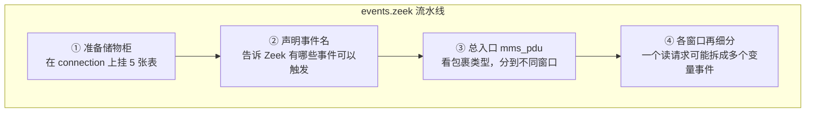
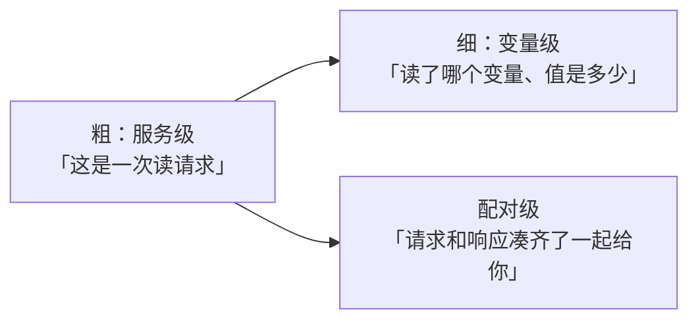
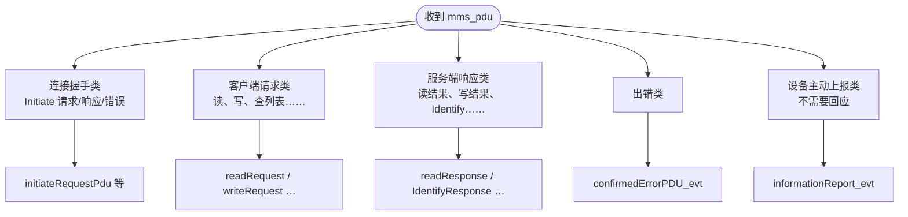
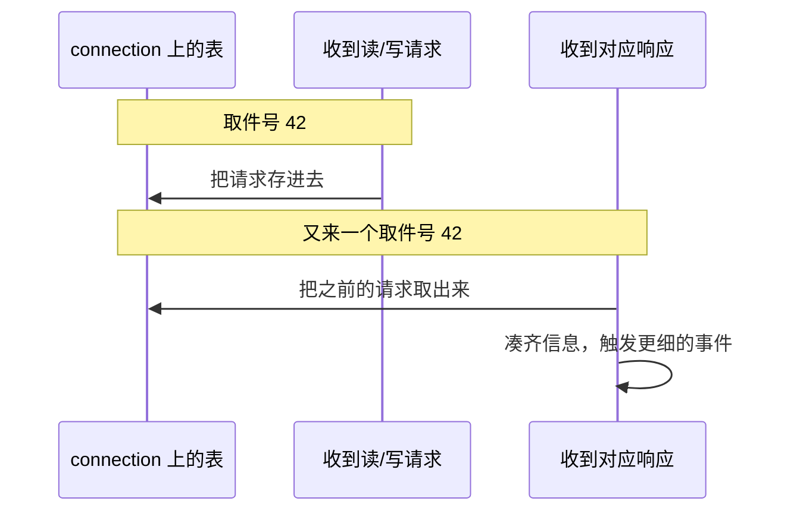
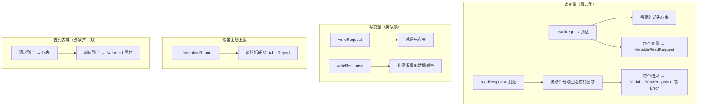

# 事件分析层：从 `mms_pdu` 到 `mms.log`

第二篇里，C++ 已经把 MMS 数据「翻译」成 Zeek 能读的结构，并触发一个总事件 `mms_pdu`。

你可以把这一步理解成：**快递员把一个大包裹送到了脚本层门口。第三篇要讲的，就是这个包裹怎么被拆开、分类、最后记进日志。**

> 包裹已经送到了（`mms_pdu`），脚本层接下来具体做什么？

## 1. 三份脚本，各干一件事

整个插件做三件事：

```text
接入 Zeek  →  解析 MMS 数据  →  生成事件和日志
```

前两篇讲完了前两步；**本篇只讲最后一步**。

涉及三个主要脚本，分工很简单：

```text
events.zeek     拆包裹：一个大 PDU 越拆越细
main.zeek       记总账：一条连接最后写一条 mms.log
var_access.zeek 等  记明细：读写变量等单独写专项日志
```

打个比方：

```text
C++ 层     把二进制变成「结构化包裹」，喊一声 mms_pdu
events.zeek  打开包裹，按类型分拣（读请求、写响应、设备上报……）
main.zeek    把设备名、协议版本等信息记在同一张「连接档案」上，连接结束归档
```

## 2. `events.zeek`：一个文件，四道工序

`plugin/scripts/events.zeek` **自己不写日志**，只负责拆事件。文件从上到下，像流水线四道工序：



① 里的「储物柜」是什么？后面第 4 节会讲——用来**暂存请求，等响应来了再配对**。

拆出来的事件，粒度分三档，越来越细：



## 3. 总入口 `mms_pdu`：先看包裹是哪一类

C++ 每解析出一个 MMS PDU，就触发一次 `mms_pdu`。脚本里的处理函数相当于**分拣员：先看标签，再送到对应窗口**。



读代码时会看到 `?$` 和 `$`：

```text
?$   「这个字段在不在？」—— 先判断是哪种包裹
$    「取出这个字段」—— 再往里看具体内容
```

因为 MMS PDU 有多种形态（读、写、上报……），不能假定每个字段都存在，所以要先问再取。

## 4. `invokeID`：给请求响应配对用的「取件号」

很多 MMS 操作是「你发请求，我等响应」。两边怎么对上号？靠 **`invokeID`**——可以把它想成**取件号**：

```text
客户端发出读请求，取件号 = 42
服务端返回读响应，取件号也是 42  →  一对
```

但有时响应里信息不全（比如读响应里可能不带「读了哪些变量」），所以脚本在收到**请求**时，先把整份请求存进 connection 上的表；**响应**到了，再按取件号把请求翻出来对照。



五张表各存一种请求（Read、Write、GetNameList 等），key 都是 `invokeID`。

## 5. 再拆一层：从一个读请求到「读了哪个变量」

一个「读请求」PDU 里可能包含**多个变量**。脚本还会再拆一层，变成「单个变量」的事件，方便后续写日志或做分析。



两种模式别搞混：

```text
有取件号（confirmed）     一问一答，请求和响应要配对
无取件号（unconfirmed）   设备自己推数据过来，没有对应的「问」
```

## 6. `main.zeek`：连接结束，写一条总日志

`events.zeek` 负责拆；`main.zeek` 负责**记连接级别的摘要**，输出到 `mms.log`。

不是来一个 PDU 写一行日志，而是：

```text
连接进行中   Identify、Initiate 等事件陆续把设备名、协议版本填进 c$mms_info
连接结束时   把攒好的信息一次性写入 mms.log
```

```text
IdentifyResponse      → 设备厂商、型号、版本
initiateResponsePdu   → 协议版本、支持的服务
connection_state_remove → 写 mms.log
```

## 7. 其他日志：记「明细」

变量读了什么、写了什么、名称列表有哪些——这些细节不在 `mms.log` 里，而在专项日志中：

```text
var_access.zeek         变量读写明细
name_list.zeek          名称列表
var_attributes.zeek     变量属性
varlist_attributes.zeek 变量列表属性
```

`mms.log` 是**连接摘要**；这些是**操作明细**。先掌握 `events.zeek` + `main.zeek` 即可。

## 8. 小结

用一句话串起来：

```text
mms_pdu 到货 → events.zeek 越拆越细 → main.zeek 记连接摘要 → mms.log
         ↘ var_access.zeek 等记操作明细
```

三篇文档的关系：

```text
第一篇   Zeek 怎么加载这个插件
第二篇   二进制 MMS 怎么变成 Zeek 数据结构
第三篇   数据结构怎么变成事件和日志（本篇）
```
