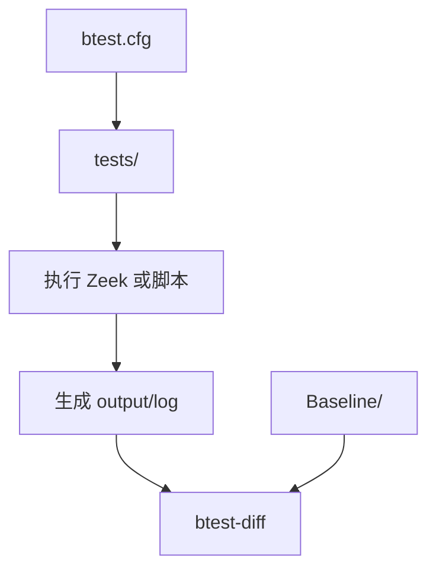
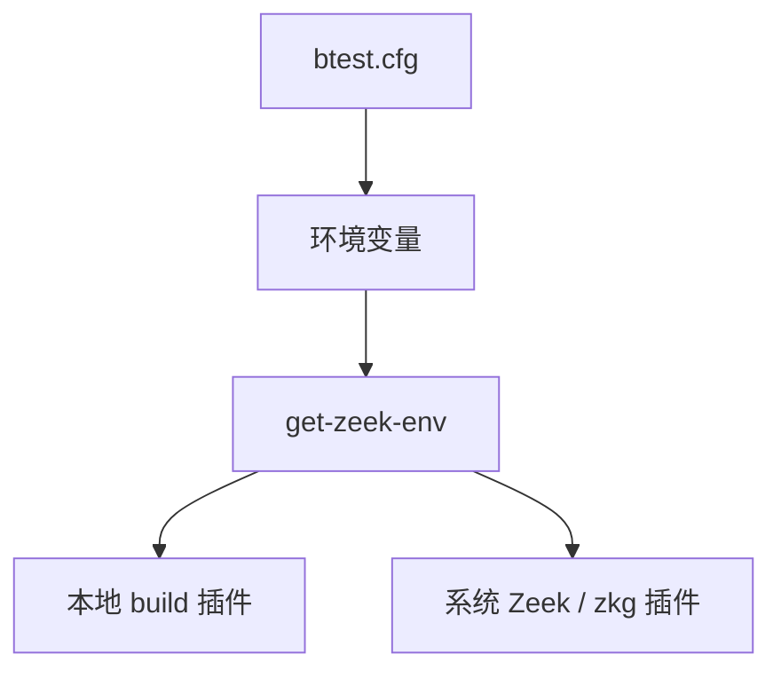
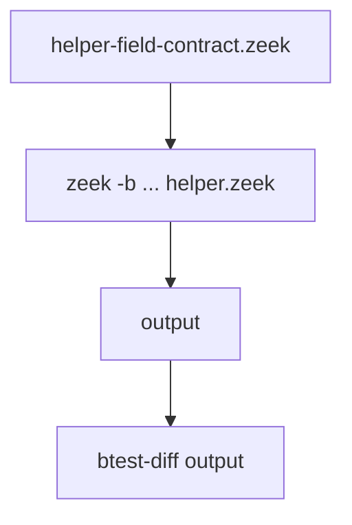
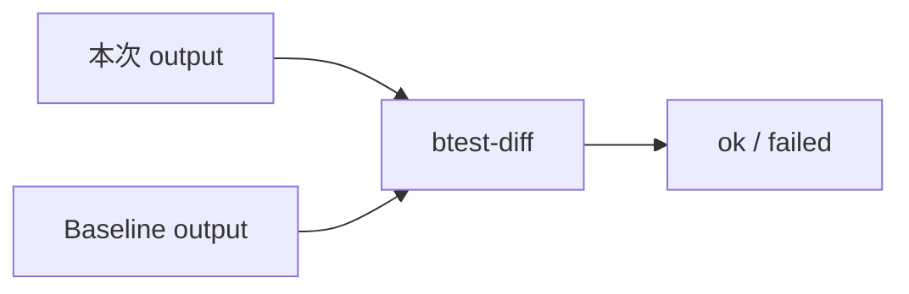

# 测试层：从 `btest` 到日志契约

前三篇讲的是插件怎么接入 Zeek、怎么解析 MMS 二进制、怎么把 `mms_pdu` 拆成事件和日志。

这一篇讲另一条线：**`testing/` 这条测试流水线，怎样把这些行为固定下来，避免后续改动把已知输出悄悄改坏。**

你可以把它理解成：

```text
测试用例进来 → 配好 Zeek 环境 → 跑 Zeek / 跑辅助脚本 → 生成输出 → 和 Baseline 对账
```

> 测试不是为了证明“代码看起来对”，而是为了证明“外部能观察到的行为没有变坏”。

## 1. `testing/`：一条测试流水线

`testing/` 目录里主要有五类东西：

```text
btest.cfg       流水线配置：测试在哪、临时目录在哪、环境变量怎么设
tests/          测试入口：每个文件声明自己要执行哪些命令
Baseline/       预期输出：btest-diff 用它判断输出有没有变
Scripts/        辅助脚本：准备环境、规整 diff、检查日志契约
Files/Traces/   测试输入：固定种子、C 测试文件、pdus.der 等
```

整体流向很短：



这条流水线的关键点是：**测试只看命令输出和日志文件，不去碰内部实现细节。**

## 2. `btest.cfg`：先把环境配好

`testing/btest.cfg` 是入口配置。它告诉 btest 三件事：

```text
测试从哪里找       TestDirs = tests
临时文件放哪里     TmpDir = .tmp
预期输出从哪里取   BaselineDir = Baseline
```

它还会设置一批环境变量，让测试用例不用自己猜路径：

```text
ZEEKPATH           Zeek 脚本搜索路径
ZEEK_PLUGIN_PATH   插件搜索路径
ZEEK_SEED_FILE     固定随机种子，减少输出漂移
PATH               Zeek 工具和测试辅助脚本路径
PACKAGE            仓库 scripts/ 目录
TRACES             测试样本目录
TEST_DIFF_CANONIFIER  diff 前的输出规整脚本
```

这里的路径不是硬编码死的，而是通过 `Scripts/get-zeek-env` 动态生成。



这样同一套测试既能跑本地构建，也能跑系统安装版 Zeek。

## 3. `tests/`：每个测试都是一张执行单

`tests/` 里的文件通过注释告诉 btest 要执行什么：

```text
# @TEST-EXEC: 命令
# @TEST-EXEC-FAIL: 预期失败的命令
```

比如 `show-plugin.zeek` 做的是插件可见性冒烟测试：

```text
zeek -NN OSS::MMS
```

它不关心插件内部怎么注册，只关心外部能不能通过 Zeek 看见这个插件。

再比如 `helper-field-contract.zeek` 会加载 `helper.zeek`，调用统一字段 helper，然后把打印结果写进 `output`：



如果测试预期某个脚本应该失败，就用 `@TEST-EXEC-FAIL`。这类测试适合检查非法枚举、非法解析状态这类“必须拦住”的行为。

当前 `btest -c testing/btest.cfg -l` 能看到这些测试：

```text
tests.show-plugin
tests.parser
tests.helper-field-contract
tests.helper-field-contract-invalid
tests.helper-field-contract-invalid-error
tests.log-contract-checker
```

## 4. `Baseline/`：预期输出就是账本

btest 的核心判断很直接：

```text
这次跑出来的 output
        vs
Baseline/ 里的预期 output
```

两边一致，测试通过；不一致，测试失败。



Baseline 的目录名和测试名对应。比如：

```text
tests/helper-field-contract.zeek
Baseline/tests.helper-field-contract/output
```

如果测试行为是有意改变的，才应该用 btest 更新 baseline。否则 baseline 变化就是一个信号：外部行为可能被改了。

## 5. `Scripts/`：流水线里的工具箱

`Scripts/` 放的是测试辅助脚本，不是插件业务逻辑。

当前最重要的几个脚本：

```text
get-zeek-env             给 btest 生成 Zeek 相关环境变量
diff-remove-timestamps   diff 前规整时间戳，减少无意义变化
check-mms-log-contract   检查 MMS 日志字段契约
```

`get-zeek-env` 解决的是“测试环境在哪”的问题：

```text
有 ZEEK_DIST   →  使用 Zeek 源码树里的工具
没有 ZEEK_DIST →  使用系统安装版 Zeek 和 zeek-config
```

`diff-remove-timestamps` 解决的是“输出里哪些东西不该影响比较”的问题。

`check-mms-log-contract` 解决的是“日志字段是不是符合约定”的问题，下一节单独讲。

## 6. 字段契约检查器：`check-mms-log-contract`

后续 MMS 日志字段补齐时，很多测试会重复检查这些事：

```text
日志文件生成了吗？
字段列存在吗？
result / parse_status / direction 的枚举值合法吗？
允许为空的字段是不是用了统一空值表达？
```

所以仓库里提供了一个统一检查器：

```text
check-mms-log-contract
```

它有四个子命令：

| 子命令 | 作用 | 例子 |
| --- | --- | --- |
| `exists` | 检查日志文件存在且非空 | `check-mms-log-contract exists mms_sample.log` |
| `fields` | 检查字段列存在，并能被 `zeek-cut` 提取 | `check-mms-log-contract fields mms_sample.log ts uid result` |
| `enum` | 检查字段值只属于允许集合 | `check-mms-log-contract enum mms_sample.log result success failure unknown not_applicable` |
| `empty` | 检查字段每行都使用 Zeek 空值表达 | `check-mms-log-contract empty mms_sample.log optional_context` |

它的边界很明确：**检查日志消费者能看到的外部契约，不检查 helper 内部怎么实现。**

当前 `tests.log-contract-checker` 用合成的 Zeek ASCII 日志 `mms_sample.log` 验证这个检查器本身。比如要保证 `parse_status` 只出现合法值，btest 里可以写：

```text
# @TEST-EXEC: check-mms-log-contract enum mms_sample.log parse_status ok partial failed not_applicable
```

后续真实业务日志测试落地后，可以把 `mms_sample.log` 换成实际生成的日志文件。这样每个日志 ticket 都可以复用同一套检查方式，不用各自写一段临时 awk。

## 7. 新增一个 btest，大概怎么走

新增测试时，可以按这个顺序想：

```text
1. 这个测试要观察什么外部行为？
2. 输入来自 Zeek 脚本、`pdus.der`，还是合成 Zeek ASCII 日志？
3. 输出应该是 stdout、XML/DER 往返结果、Zeek ASCII 日志，还是错误信息？
4. 是否需要 btest-diff 和 Baseline？
5. 是否能复用 Scripts/ 里的辅助检查器？
```

最小形态通常是：

```text
# @TEST-EXEC: 运行命令 > output
# @TEST-EXEC: btest-diff output
```

如果测试会生成或合成 Zeek ASCII 日志，可以再加字段契约检查。当前已有的 `tests.log-contract-checker` 就是先合成 `mms_sample.log`，再检查字段契约：

```text
# @TEST-EXEC: check-mms-log-contract exists mms_sample.log
# @TEST-EXEC: check-mms-log-contract fields mms_sample.log ts uid result parse_status
# @TEST-EXEC: check-mms-log-contract enum mms_sample.log result success failure unknown not_applicable
```

如果命令应该失败，就明确写成：

```text
# @TEST-EXEC-FAIL: zeek ... 2> error
# @TEST-EXEC: btest-diff error
```

这样失败本身也会成为被固定下来的行为。

## 8. 不同测试看不同边界

这个仓库里测试边界大致分四层：

| 测试类型 | 观察边界 | 适合检查什么 |
| --- | --- | --- |
| 插件冒烟测试 | `zeek -NN OSS::MMS` | 插件是否能被 Zeek 看见 |
| helper 测试 | Zeek 脚本公开 helper 输出 | 字段默认值、枚举、风险判断 |
| parser 样本测试 | `pdus.der` 与 XML/DER 往返 | `test-parser` 解析和再编码是否稳定 |
| 日志契约测试 | Zeek ASCII 日志样本 | 文件、字段、枚举、空值表达 |

不要把所有事都塞进一个测试。好的测试应该只盯一个外部边界：

```text
插件能加载      → show-plugin
helper 输出稳定 → helper-field-contract
日志字段合法    → check-mms-log-contract
样本解析稳定    → parser
```

这样某个测试失败时，才容易看出是哪一层出问题。

## 9. 小结

用一句话串起来：

```text
btest.cfg 配环境 → tests/ 执行命令 → Zeek/脚本生成输出 → btest-diff 对 Baseline → 字段契约检查器守住 Zeek ASCII 日志约定
```

前四篇文档的关系：

```text
第一篇   Zeek 怎么加载这个插件
第二篇   二进制 MMS 怎么变成 Zeek 数据结构
第三篇   数据结构怎么变成事件和日志
第四篇   testing/ 怎么把这些行为固定成回归测试（本篇）
```
